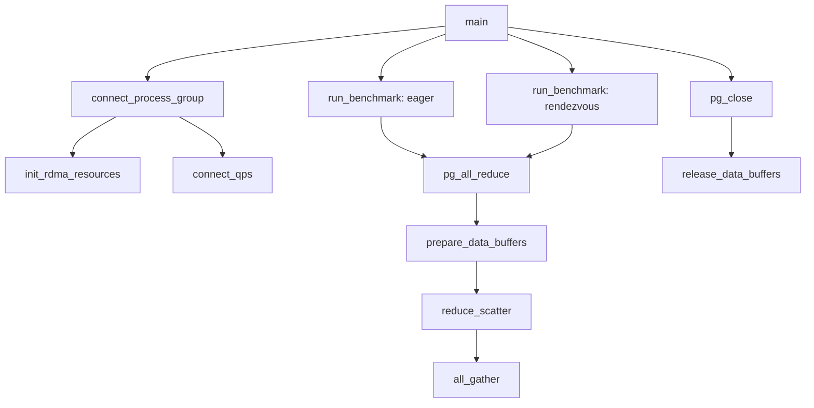

# Function Guide

This document explains the structures and functions in `allreduce.h`,
`ex3n.cpp`, and `main.cpp`.

## Execution Flow



## Public Types

### `DATATYPE`

Declared in `allreduce.h`.

- `TYPE_INT32` selects 32-bit signed integers.
- `TYPE_FP64` selects double-precision floating-point values.

### `OPERATION`

Declared in `allreduce.h`.

- `OP_SUM` adds corresponding elements.
- `OP_PRODUCT` multiplies corresponding elements.

### `PROTOCOL`

Private to `ex3n.cpp`.

- `PROTOCOL_EAGER` uses Verbs SEND/RECV.
- `PROTOCOL_RENDEZVOUS` uses a control-message handshake followed by RDMA
  Write with Immediate.

### `control_type`

Identifies Rendezvous control messages.

- `RENDEZVOUS_REQUEST` announces a transfer and its size.
- `RENDEZVOUS_READY` returns the destination address and remote key.
- `RENDEZVOUS_FIN` is defined but is not currently used because
  Write-with-Immediate provides completion notification.

### `wr_type`

Assigns categories to work requests. The values identify Eager sends and
receives, control traffic, RDMA writes, and Write-with-Immediate receive
notifications.

## Data Structures

### `control_message`

Carries the Rendezvous handshake:

- `type`: request or ready message.
- `size`: transfer size.
- `addr`: receiver virtual address.
- `rkey`: receiver memory-region remote key.

### `remote_region`

Stores chunk-level Rendezvous metadata returned by a READY message:

- Remote base address.
- Remote key.
- Logical chunk size.

### `rdma_peer`

Stores information exchanged during TCP bootstrap:

- LID
- Queue-pair number
- Packet sequence number
- Optional remote address and remote key fields

### `process_group`

The private object returned through `pg_handle`. It contains:

- Process rank and ring size.
- Previous and next ranks.
- RDMA device context.
- Protection domain.
- Shared completion queue.
- Queue pairs to the previous and next processes.
- Registered receive and staging buffers.
- Capacity of the currently registered receive buffer.
- Registered Rendezvous control buffers.
- Previous and next peer connection information.
- A small array for completions that arrived before the completion currently
  being awaited.

## General Helpers

### `make_rendezvous_wr_id`

Combines a work-request category with a segment sequence number. The category
is stored in the high bits and the segment number in the low bits. This gives
each pipelined Rendezvous send and receive a distinct completion identifier.

### `datatype_size`

Returns the element size for `TYPE_INT32` or `TYPE_FP64`. It returns zero for
an unsupported datatype.

### `reduce_typed`

Template implementing element-by-element SUM or PRODUCT for a concrete C++
type.

### `reduce`

Dispatches to `reduce_typed<int32_t>` or `reduce_typed<double>` according to
the requested datatype.

## Completion and Receive Helpers

### `post_receive`

Builds one `ibv_sge` and one `ibv_recv_wr`, then posts the receive to the
specified queue pair with `ibv_post_recv`.

### `wait_for_completion`

Waits for a specific work-request ID.

1. Checks previously saved completions.
2. Busy-polls the completion queue with `ibv_poll_cq`.
3. Returns when the expected completion arrives.
4. Saves unrelated successful completions for later.
5. Reports failed completions or pending-array overflow.

This behavior is required because pipelined operations may complete in a
different order from the order in which the CPU waits for them.

## RDMA Resource Management

### `init_rdma_resources`

Creates resources that live for the entire process group:

1. Gets the first available RDMA device.
2. Opens its device context.
3. Allocates a protection domain.
4. Creates a shared completion queue.
5. Allocates and registers control send and receive buffers.
6. Allocates and registers the two-slot staging buffer.
7. Creates one reliable-connected QP for NEXT.
8. Creates one reliable-connected QP for PREV.

### `prepare_data_buffers`

Called at the start of each All-Reduce. It reuses the current receive MR when
the buffer pointer is unchanged and the registered capacity is large enough.
If the pointer changes or the requested size grows, it deregisters the old MR
and registers the new range for local and remote writes.

The staging buffer is not handled here; it is allocated and registered once
by `init_rdma_resources`.

### `release_data_buffers`

Deregisters the cached receive MR and persistent staging MR, frees the staging
buffer, and clears the stored pointers. It is used during final process-group
cleanup rather than after every collective.

### `pg_close`

Releases the complete process group:

1. Releases the cached receive MR and persistent staging resources.
2. Destroys both queue pairs.
3. Deregisters both control memory regions.
4. Frees both control buffers.
5. Destroys the completion queue.
6. Deallocates the protection domain.
7. Closes the RDMA device.
8. Frees the `process_group`.

Passing a null handle is treated as a successful no-op.

## QP Connection Setup

### `connect_one_qp`

Moves one reliable-connected queue pair through the required states:

```text
RESET -> INIT -> RTR -> RTS
```

It configures remote read/write access, the remote QP number, LID, PSN,
retry settings, and atomic-operation limits.

### `tcp_send_all`

Repeatedly calls `send` until the complete bootstrap structure has been
transmitted or an error occurs.

### `tcp_recv_all`

Repeatedly calls `recv` until the complete bootstrap structure has been
received or an error occurs.

### `tcp_accept_exchange`

Accepts a TCP connection from PREV. The accepted client sends its local peer
description first; the server receives it and replies with its own.

### `tcp_create_listener`

Creates an IPv4 TCP listening socket on the bootstrap port. It enables address
reuse, binds to all local interfaces, and starts listening.

### `tcp_client_exchange`

Resolves the NEXT hostname and repeatedly attempts to connect. After
connecting, it sends the local peer description and receives the remote peer
description.

### `connect_qps`

Builds the two ring links:

1. Queries the local RDMA port LID.
2. Creates separate PSNs for the two local QPs.
3. Starts a TCP listener on port 18515.
4. Exchanges QP information with PREV and NEXT.
5. Alternates connect/accept order by rank parity to avoid bootstrap deadlock.
6. Connects both QPs through `connect_one_qp`.

The resulting pairings are:

```text
local next_qp <-> NEXT process prev_qp
local prev_qp <-> PREV process next_qp
```

### `parse_server_config`

Parses the exercise command format:

```text
-myindex INDEX -list HOST1 HOST2 ...
```

The command-line index is one-based and is converted to a zero-based internal
rank. At least two hosts are required.

### `connect_process_group`

Public setup API:

1. Parses rank and host list.
2. Allocates and initializes `process_group`.
3. Computes previous and next ranks with modulo arithmetic.
4. Initializes local RDMA resources.
5. Connects the two QPs.
6. Returns the group through `pg_handle`.

On failure, it calls `pg_close` to release partially created resources.

## Eager Protocol

### `post_eager_send`

Posts an Eager SEND with the standard Eager work-request ID and returns
without waiting. All Gather uses it before waiting separately for receive and
send completions.

### `post_eager_send_with_id`

Posts an Eager SEND with a caller-provided ID. Reduce Scatter uses segment
numbers in these IDs so multiple pipeline operations can be distinguished.

## Rendezvous Protocol

### `wait_for_control_message`

Posts a receive for a control message on either the previous or next QP,
waits for completion, verifies message size and opcode, and checks the
expected control-message type.

### `send_control_message`

Fills the registered control send buffer, posts an `IBV_WR_SEND` on the
selected QP, and waits until that small control message has been sent.

### `request_remote_region`

Performs the sender side of the chunk-level handshake:

1. Sends one `RENDEZVOUS_REQUEST` containing the complete chunk size.
2. Waits for one `RENDEZVOUS_READY`.
3. Validates the returned size.
4. Stores the remote base address and rkey in `remote_region`.

No data Work Request is posted by this function.

### `post_rendezvous_notification`

Posts a zero-SGE receive WQE on `prev_qp`. A remote
`IBV_WR_RDMA_WRITE_WITH_IMM` consumes this WQE and creates the segment
completion.

### `advertise_local_region`

Performs the receiver side of the chunk-level handshake:

1. Waits for `RENDEZVOUS_REQUEST`.
2. Validates the complete chunk size.
3. Posts the first segment notification receive.
4. Sends one `RENDEZVOUS_READY` containing the local base address and rkey.

Reduce Scatter advertises the staging-buffer base. All Gather advertises the
final destination chunk in `recv_buf`.

### `post_rendezvous_write`

Posts one segment as `IBV_WR_RDMA_WRITE_WITH_IMM`. The caller supplies the
remote address, rkey, work-request ID, and segment number. The segment number
is placed in immediate data so the receiver can validate ordering.

### `finish_rendezvous_write`

Waits for a segment's local RDMA Write completion and verifies the
`IBV_WC_RDMA_WRITE` opcode.

### `finish_rendezvous_notification`

Waits for the incoming Write-with-Immediate completion. It verifies:

- `IBV_WC_RECV_RDMA_WITH_IMM`
- Presence of immediate data
- The expected segment number

## Collective Operations

### `reduce_scatter`

Divides the full buffer into `P` equal chunks and performs `P - 1` ring steps.
At each step, a process:

1. Sends one chunk toward NEXT.
2. Receives one chunk from PREV into the staging buffer.
3. Reduces the received values into the corresponding local chunk.

Each chunk is divided into 64 KiB segments. Two staging slots are used in a
round-robin arrangement.

For Eager, the next SEND and receive are posted before reducing the current
segment.

For Rendezvous, rank parity chooses which side performs the single chunk
handshake first. The READY message advertises the staging-buffer base and
rkey. Segment writes alternate between the two staging slots using remote
address offsets. The next notification receive and RDMA Write are posted
before reducing the current segment, and the current send completion is
collected after reduction.

After `P - 1` steps, each process owns one completely reduced chunk.

### `all_gather`

Circulates the reduced chunks for another `P - 1` ring steps until every
process has the complete result.

- Eager posts a receive directly into the destination chunk, posts SEND, and
  waits for both completions.
- Rendezvous performs one handshake per chunk, then writes every segment to
  `remote_base + offset` in the final destination chunk. The next segment is
  posted before the previous send completion is collected. This is the
  large-message zero-copy path.

### `pg_all_reduce`

Public collective API:

1. Validates the handle, buffers, count, datatype, and operation.
2. Chooses Eager or Rendezvous from `ALLREDUCE_PROTOCOL`.
3. Requires `count` to be divisible by the ring size.
4. Copies `send_buf` into `recv_buf` unless the call is in place.
5. Reuses or grows the cached receive-buffer MR.
6. Calls `reduce_scatter`.
7. Calls `all_gather`.

It returns zero on success and `-1` on failure.

The receive buffer must remain allocated until a later call registers a
different buffer or until `pg_close`.

## Test Program

### `benchmark_result`

Stores the outcome of one protocol and message-size benchmark:

- Correctness status.
- Average latency in milliseconds.
- Minimum latency in milliseconds.

### `verify_result`

Checks every element in a receive buffer against the expected All-Reduce
result and reports the first mismatch.

### `run_benchmark`

Runs one protocol at one message size:

1. Sets `ALLREDUCE_PROTOCOL`.
2. Uses the persistent maximum-sized input and output vectors owned by
   `main`.
3. Fills the active input range with `rank + 1`.
4. Runs one unmeasured warm-up All-Reduce.
5. Runs five measured All-Reduce iterations.
6. Checks every output element after every call.
7. Returns average latency, minimum latency, and correctness status.

### `main`

The executable entry point:

1. Validates `-myindex INDEX -list HOSTS...`.
2. Determines the local rank and process count.
3. Reconstructs the configuration string for `connect_process_group`.
4. Connects the RDMA ring.
5. Allocates maximum-sized send and receive vectors once.
6. Starts with one `int32_t` element per process.
7. Doubles the total message size until 1 MiB.
8. Benchmarks Eager and Rendezvous at each size.
9. Prints a comparison table from rank zero.
10. Calls `pg_close` while the registered receive vector is still alive.
11. Returns nonzero if setup, any benchmark, or cleanup fails.
