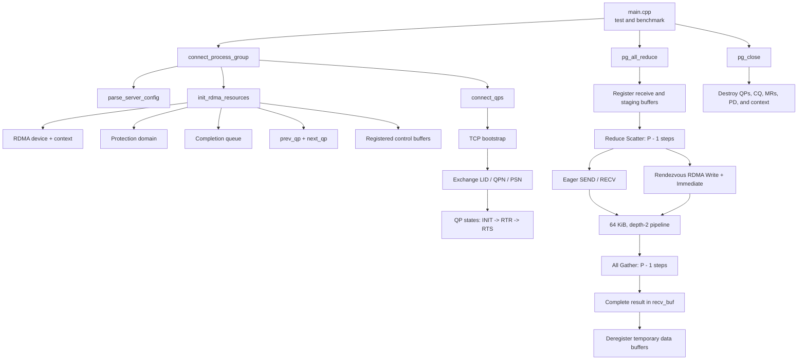
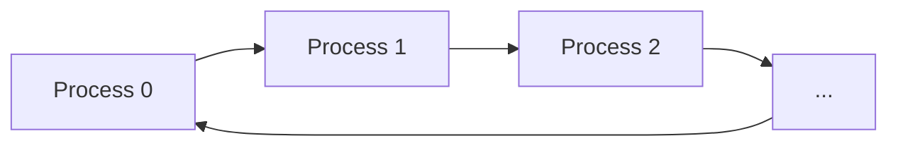
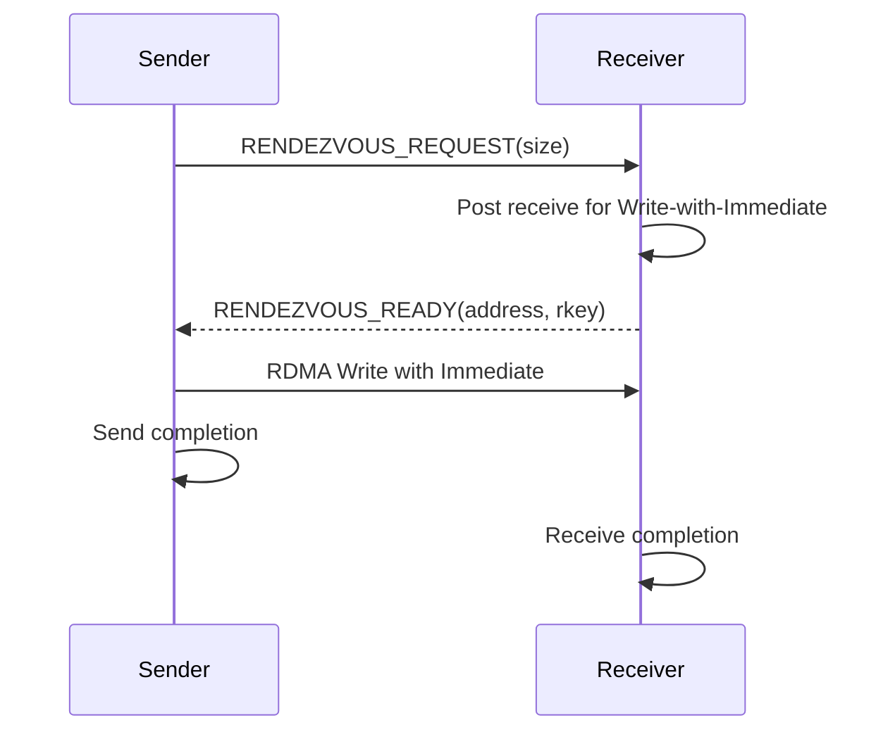

# Exercise 3: Ring All-Reduce with RDMA

This project implements a single-threaded Ring All-Reduce using the
InfiniBand Verbs API. Processes form a ring, exchange RDMA connection
information over TCP, and communicate with their previous and next neighbors
using reliable-connected queue pairs.

All-Reduce is implemented as:

```text
All-Reduce = Reduce Scatter + All Gather
```

The implementation supports:

- Two or more processes, with the exercise tested on 2 and 4.
- `TYPE_INT32` and `TYPE_FP64`.
- `OP_SUM` and `OP_PRODUCT`.
- Eager communication using `IBV_WR_SEND`.
- Rendezvous communication using `IBV_WR_RDMA_WRITE_WITH_IMM`.
- Two-buffer pipelining with 64 KiB segments during Reduce Scatter.
- Zero-copy Rendezvous All Gather directly into the final receive buffer.

## Architecture



Each process communicates only with its two ring neighbors:



## Rendezvous Protocol



During pipelined Reduce Scatter, the next segment is posted before the current
segment is reduced. Communication for segment `i + 1` can therefore progress
while the CPU reduces segment `i`.

## Files

| File | Purpose |
|---|---|
| `allreduce.h` | Public datatypes, operations, and API declarations. |
| `ex3n.cpp` | RDMA setup, protocols, collectives, and cleanup. |
| `main.cpp` | Minimal correctness and timing test for both protocols. |
| `Makefile` | Builds the `test` executable. |
| `FUNCTION_GUIDE.md` | Function-by-function implementation guide. |

## Requirements

Build and run on Linux machines with RDMA hardware and:

- GNU Make
- A C++11 compiler
- libibverbs headers and library

On Debian or Ubuntu, the development package is normally:

```bash
sudo apt install build-essential libibverbs-dev
```

## Build

```bash
make
```

This creates:

```text
test
```

To remove the executable:

```bash
make clean
```

## Run

Start one process on each listed machine. Every process must use the same host
list and run the same tests in the same order.

### Two processes

On `mlxstud01`:

```bash
./test -myindex 01 -list mlxstud01 mlxstud02
```

On `mlxstud02`:

```bash
./test -myindex 02 -list mlxstud01 mlxstud02
```

### Four processes

```bash
# mlxstud01
./test -myindex 01 -list mlxstud01 mlxstud02 mlxstud03 mlxstud04

# mlxstud02
./test -myindex 02 -list mlxstud01 mlxstud02 mlxstud03 mlxstud04

# mlxstud03
./test -myindex 03 -list mlxstud01 mlxstud02 mlxstud03 mlxstud04

# mlxstud04
./test -myindex 04 -list mlxstud01 mlxstud02 mlxstud03 mlxstud04
```

The programs should be started close together because each client retries its
TCP bootstrap connection for approximately ten seconds.

## Test Program

`main.cpp` runs the same `TYPE_INT32` and `OP_SUM` test twice:

1. `ALLREDUCE_PROTOCOL=eager`
2. `ALLREDUCE_PROTOCOL=rendezvous`

Process rank `r` fills its input with `r + 1`. For `P` processes, every result
element must equal:

```text
P * (P + 1) / 2
```

Each process contributes 65,536 elements per ring chunk. Every chunk is
256 KiB and is divided into four 64 KiB segments, so the test exercises the
pipeline.

Example rank-zero output:

```text
eager: PASS, 1.23 ms
rendezvous: PASS, 0.87 ms
```

## Public API

```cpp
int connect_process_group(char *servername, void **pg_handle);

int pg_all_reduce(void *send_buf,
                  void *recv_buf,
                  int count,
                  DATATYPE datatype,
                  OPERATION op,
                  void *pg_handle);

int pg_close(void *pg_handle);
```

`pg_all_reduce` requires `count` to be divisible by the number of processes.
The `ALLREDUCE_PROTOCOL` environment variable must be either `eager` or
`rendezvous`; if it is unset, Eager is used.

## Current Constraints

- TCP bootstrap uses fixed port `18515`.
- RDMA port 1 and LID-based InfiniBand addressing are used.
- All machines are expected to have compatible architectures.
- Completion polling is busy-wait based.
- All processes must call collectives in the same order with identical
  arguments.

See [FUNCTION_GUIDE.md](FUNCTION_GUIDE.md) for implementation details.
