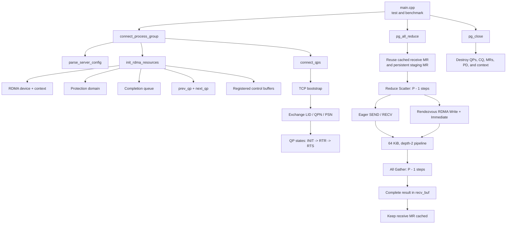
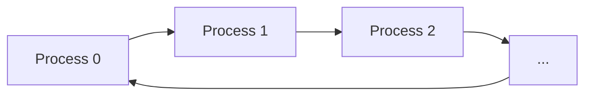
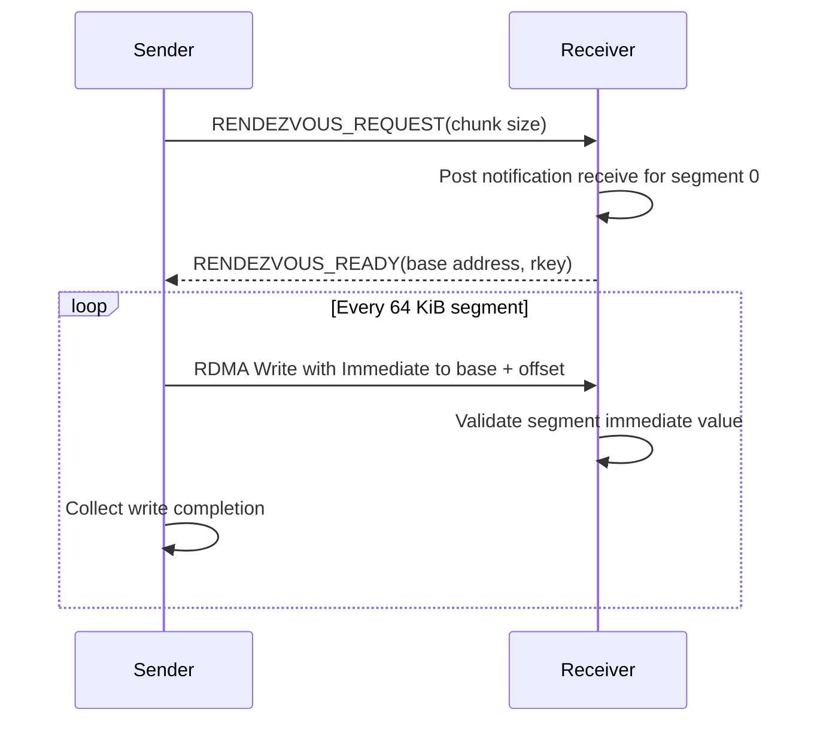

# Exercise 3: Ring All-Reduce with RDMA

This project implements a single-threaded Ring All-Reduce using the
InfiniBand Verbs API. Processes form a ring, exchange RDMA connection
information over TCP, and communicate with their previous and next neighbors
using reliable-connected queue pairs.

All-Reduce is implemented as:

```text
All-Reduce = Reduce Scatter + All Gather
```

The implementation supports:

- Two or more processes, with the exercise tested on 2 and 4.
- `TYPE_INT32` and `TYPE_FP64`.
- `OP_SUM` and `OP_PRODUCT`.
- Eager communication using `IBV_WR_SEND`.
- Rendezvous communication using `IBV_WR_RDMA_WRITE_WITH_IMM`.
- One Rendezvous REQUEST/READY handshake per ring chunk.
- Two-buffer pipelining with 64 KiB segments during Reduce Scatter.
- Zero-copy Rendezvous All Gather directly into the final receive buffer.
- A persistent registered staging buffer and cached receive-buffer registration.

## Architecture



Each process communicates only with its two ring neighbors:



## Rendezvous Protocol



REQUEST/READY is exchanged once per chunk, not once per segment. During
pipelined Reduce Scatter, the notification receive and RDMA Write for segment
`i + 1` are posted before segment `i` is reduced. Communication can therefore
progress while the CPU performs the current reduction.

## Files

| File | Purpose |
|---|---|
| `allreduce.h` | Public datatypes, operations, and API declarations. |
| `allreduce.cpp` | RDMA setup, protocols, collectives, and cleanup. |
| `main.cpp` | Correctness benchmark across message sizes for both protocols. |
| `Makefile` | Builds the `test` executable. |
| `FUNCTION_GUIDE.md` | Function-by-function implementation guide. |
| `SUBMISSION_INTERVIEW_GUIDE.md` | Submission checklist and interview preparation. |

## Requirements

Build and run on Linux machines with RDMA hardware and:

- GNU Make
- A C++11 compiler
- libibverbs headers and library

On Debian or Ubuntu, the development package is normally:

```bash
sudo apt install build-essential libibverbs-dev
```

## Build

```bash
make
```

This creates:

```text
test
```

To remove the executable:

```bash
make clean
```

## Run

Start one process on each listed machine. Every process must use the same host
list and run the same tests in the same order.

### Two processes

On `mlx-stud-01`:

```bash
./test -myindex 01 -list mlx-stud-01 mlx-stud-02
```

On `mlx-stud-02`:

```bash
./test -myindex 02 -list mlx-stud-01 mlx-stud-02
```

### Four processes

```bash
# mlx-stud-01
./test -myindex 01 -list mlx-stud-01 mlx-stud-02 mlx-stud-03 mlx-stud-04

# mlx-stud-02
./test -myindex 02 -list mlx-stud-01 mlx-stud-02 mlx-stud-03 mlx-stud-04

# mlx-stud-03
./test -myindex 03 -list mlx-stud-01 mlx-stud-02 mlx-stud-03 mlx-stud-04

# mlx-stud-04
./test -myindex 04 -list mlx-stud-01 mlx-stud-02 mlx-stud-03 mlx-stud-04
```

The programs should be started close together because each client retries its
TCP bootstrap connection for approximately one minute.

## Test Program

`main.cpp` benchmarks `TYPE_INT32` with `OP_SUM` using both protocols:

1. `ALLREDUCE_PROTOCOL=eager`
2. `ALLREDUCE_PROTOCOL=rendezvous`

Because the API uses 32-bit elements and requires equal ring chunks, the first
message contains one integer per process. The total message size then doubles
until it reaches 1 MiB.

For every message size and protocol, the program runs:

- One unmeasured warm-up.
- Five measured iterations.
- A complete correctness check after every call.

The benchmark allocates maximum-sized send and receive vectors once and keeps
them alive until `pg_close`. The receive MR is reused while its pointer and
registered capacity remain compatible. When the tested size grows, the
unmeasured warm-up expands the registration before timing begins.

Process rank `r` fills its input with `r + 1`. For `P` processes, every result
element must equal:

```text
P * (P + 1) / 2
```

Rank zero prints average latency, minimum latency, Rendezvous speedup over
Eager, and correctness status:

```text
Bytes       Eager avg ms    Eager min ms    Rendezvous avg ms   Rendezvous min ms   Speedup     Result
16          0.1200          0.1000          0.1800              0.1600              0.6667      PASS
32          0.1300          0.1100          0.1900              0.1700              0.6842      PASS
...
1048576     40.0000         38.0000         12.0000             11.0000             3.3333      PASS
```

## Public API

```cpp
int connect_process_group(char *servername, void **pg_handle);

int pg_all_reduce(void *send_buf,
                  void *recv_buf,
                  int count,
                  DATATYPE datatype,
                  OPERATION op,
                  void *pg_handle);

int pg_close(void *pg_handle);
```

`pg_all_reduce` requires `count` to be divisible by the number of processes.
The `ALLREDUCE_PROTOCOL` environment variable must be either `eager` or
`rendezvous`; if it is unset, Eager is used.

## Current Constraints

- TCP bootstrap uses fixed port `18515`.
- RDMA port 1 and LID-based InfiniBand addressing are used.
- All machines are expected to have compatible architectures.
- Completion polling is busy-wait based.
- All processes must call collectives in the same order with identical
  arguments.
- A receive buffer must remain allocated until a different receive buffer is
  registered by a later call or until `pg_close`.

See [FUNCTION_GUIDE.md](FUNCTION_GUIDE.md) for implementation details and
[SUBMISSION_INTERVIEW_GUIDE.md](SUBMISSION_INTERVIEW_GUIDE.md) for the
submission checklist and interview preparation.
